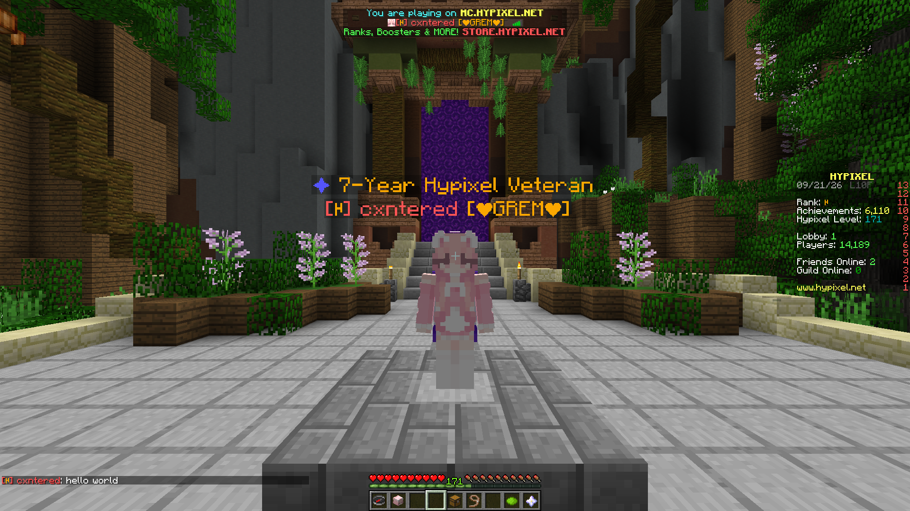

# `RankSpoof`

A mod to spoof your Hypixel Rank

This is the legacy branch (`v1`), made for 1.8.9. To see the modern version (`v2`), made for the latest versions of Minecraft, check out the [`modern` branch](https://github.com/cxntered/RankSpoof/tree/modern).

Based on [`CustomRankUpdated`](https://www.chattriggers.com/modules/v/CustomRankUpdated) by Alexandra for ChatTriggers (which is an updated version of [`CustomRank`](https://www.chattriggers.com/modules/v/CustomRank) by Heknon).

*Small disclaimer:* This version of RankSpoof does not provide a config screen, so in order to toggle on/off the mod or change settings, you will have to use a mod like [OneConfig](https://modrinth.com/mod/oneconfig) or manually edit the config file.

---

Showcase

